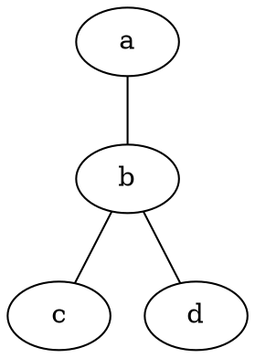
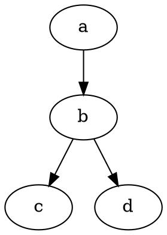

# SimpleNavigator
_Last updated May 2025_

## Introduction

This is the C++20 & CLI implementation of s21_graph & s21_graph_algorithms libraries.

To be used within the app, graphs must meet the following requirements:
- Edge weights are natural numbers only.
  
- There may be loops.
- Weights can be different on all edges.
- Only a non-zero connected graph.

To be loaded from a file, a graph must be represented as an adjacency matrix. On the first line write the number of vertices, starting from the second line set the weights of the edges (0 if there is no edge):

```
11
0   29  20  21  16  31  100 12  4   31  18
29  0   15  29  28  40  72  21  29  41  12
20  15  0   15  14  25  81  9   23  27  13
21  29  15  0   4   12  92  12  25  13  25
16  28  14  4   0   16  94  9   20  16  22
31  40  25  12  16  0   95  24  36  3   37
100 72  81  92  94  95  0   90  101 99  84
12  21  9   12  9   24  90  0   15  25  13
4   29  23  25  20  36  101 15  0   35  18
31  41  27  13  16  3   99  25  35  0   38
18  12  13  25  22  37  84  13  18  38  0
```

After loading, graphs can be exported as DOT files to be used in special programs, such as **Graphviz**. For example, an undirected graph may be represented like this:



And directed graph -- like this:


  
## Installation & Running

### Prerequisites

Correct compilation and running of the program depends on other utilities and libraries. Check that you have their latest versions before proceeding: 

| Compilation targets | Utilities |
| ------------------- | --------- |
| App Compilation & Running | gcc, make |
| Testing | GTest library |
| GCOV Report | gcov, lcov |
| Leaks Check | valgrind |

</br>

### Setup

Download or clone (`git clone <link_to_git_folder>`) the source repository to where you can easily find it. Then type and run the following commands in the terminal: 

1. `cd <path_to_git_folder>/src`

2. `make app`

If there are errors, you're likely missing some packages. Check __Prerequisites__.

</br>

### Usage

The console interface provides the following functionality:

1. Load the graph from a file.
   
3. Export the graph to DOT.
2. Traverse the graph in breadth and print the result to the console.   
3. Traverse the graph in depth and print the result to the console.
4. Find the shortest path between any two vertices and print the result to the console.
5. Find the shortest paths between all pairs of vertices in the graph and print the result matrix to the console.
6. Search for the minimum spanning tree in the graph and print the resulting adjacency matrix to the console.
7. Solve the Traveling Salesman problem, with output of the resulting route and its length to the console.
8. Solve the Traveling Salesman problem N times using three different methods and print the results of time measurement.
9. Exit.

## Structure & Testing

The **s21_graph** library is represented as a `Graph` class that stores information about the graph using an **adjacency matrix** -- its dimensions are set dynamically when the graph is loaded from a file. The `Graph` class handles I/O using two methods:
+ `LoadGraphFromFile(string filename)` — loading a graph from a file in the adjacency matrix format.

+ `ExportGraphToDot(string filename)`- exporting a graph to a DOT file.

The **s21_graph_algorithms** library is represented as a `GraphAlgorithms` class that stores the implementation of algorithms on graphs. It contains the following methods:
+ `DepthFirstSearch(Graph &graph, int start_vertex)` — a *non-recursive* depth-first search in the graph from a given vertex. The function returns an array that contains the traversed vertices in the order they were traversed and uses the *self-written* data structure **stack**.
  
+ `BreadthFirstSearch(Graph &graph, int start_vertex)` — breadth-first search in the graph from a given vertex. The function returns an array that contains the traversed vertices in the order they were traversed and uses the *self-written* data structure **queue**, which is based on the structure **list**.
+ `GetShortestPathBetweenVertices(Graph &graph, int vertex1, int vertex2)` — searches for the shortest path between two vertices in a graph using *Dijkstra's algorithm*. The function accepts as input the numbers of two vertices and returns a numerical result equal to the smallest distance between them.
+ `GetShortestPathsBetweenAllVertices(Graph &graph)` — searches for the shortest paths between all pairs of vertices in a graph using the *Floyd-Warshall algorithm*. As a result, the function returns the matrix of the shortest paths between all vertices of the graph.
+ `GetLeastSpanningTree(Graph &graph)` — searches for the minimal spanning tree in a graph using *Prim's algorithm*. As a result, the function returns the adjacency matrix for the minimal spanning tree.
+ `SolveTravelingSalesmanProblem(Graph &graph)` — solves the traveling salesman's problem using the *ant colony algorithm*. As a result, the function returns the `TsmResult` structure described below:
```cpp
struct TsmResult {
  std::vector<int> vertices; // an array with the route you are looking for (with the vertex traverse order).
  double distance; // the length of this route
}
``` 
+ `BruteForceAlgorithm(Graph &graph)` — solves the traveling salesman's problem using the *brute force method*. As a result, the function returns the `TsmResult` structure.
+  `BranchAndBoundAlgorithm(Graph &graph)` — solves the traveling salesman's problem using the *branch and bound method*. As a result, the function returns the `TsmResult` structure.

The program was made using C++20 language and standard libraries. The source code for self-written containers can be found in `src/containers`. The graph and container libraries can be tested with GTest: 

1. To run tests: `make test`

2. To display test coverage: `make gcov_report`

3. To check for leaks: `make valgrind` (can take a long time due to algorithm testing; see comments in `src/tests/test_algorithms.cpp`)

NOTE: the files in `src/assets` are necessary for testing. Please don't edit or delete them.

## P.s.

If you wish to suggest an improvement or report a bug, contact me __@ginzburg_jake (Telegram) or JakeTheSillySnake (GitHub)__.
